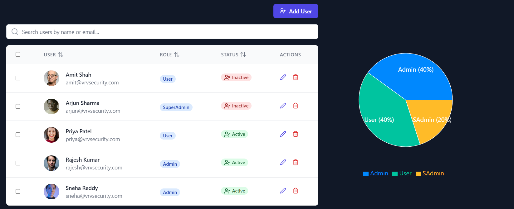
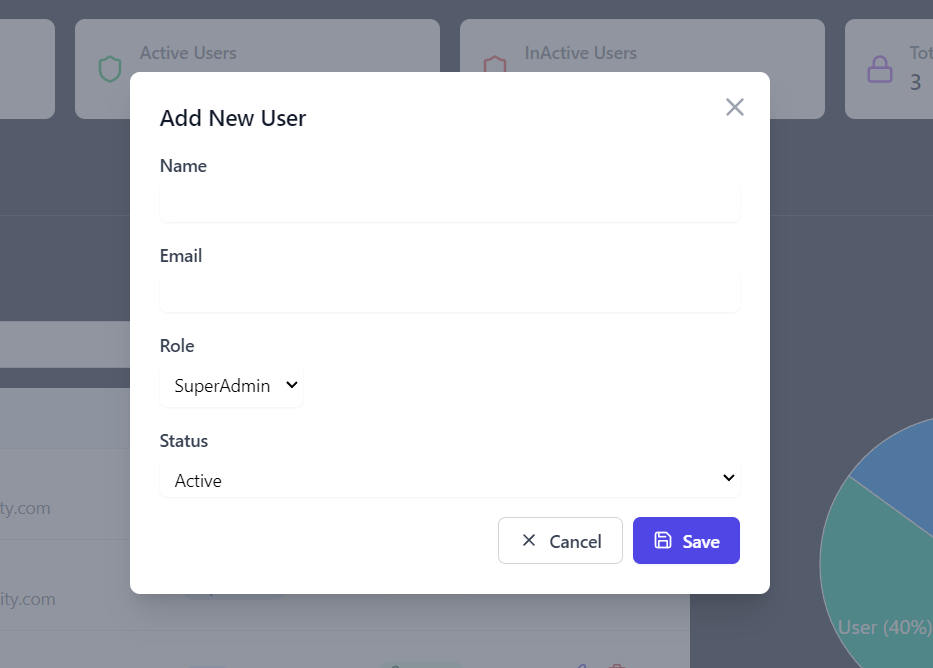
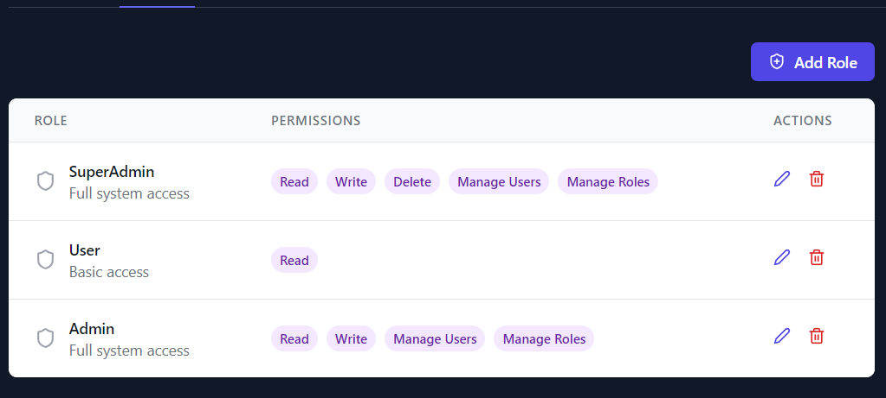

# 🔐 Role-Based Access Control (RBAC) Dashboard

Welcome to the **Role-Based Access Control (RBAC) Dashboard** project! 🎉 This project is a fully functional, interactive admin dashboard that allows administrators to manage users, roles, and permissions efficiently while adhering to best practices in security and UI/UX. 🚀

---

## 🖼️ **Project Overview**

The RBAC Dashboard provides a user-friendly interface for managing:

- **👥 User Management:** Add, edit, delete users, and manage their roles and statuses.
- **📋 Role Management:** Create, edit, and delete roles with customizable permissions.
- **🔒 Dynamic Permissions:** Assign and modify role-specific permissions dynamically.

This dashboard is a powerful tool for organizations to enforce role-based security policies while maintaining a seamless user experience. 💼

---

## ✨ **Features**

### 👥 **User Management**
- Add new users to the system.
- Edit user details, assign roles, and toggle active/inactive status.
- Delete users safely with confirmation prompts.

### 📋 **Role Management**
- Define roles with custom names and attributes.
- Assign multiple permissions (e.g., Read, Write, Delete) to roles.
- View all roles and their associated permissions at a glance.

### 🔒 **Permission Management**
- Create custom permissions for roles.
- View and edit permissions in an intuitive interface.

### 🚀 **Additional Features**
- **Responsive Design:** Works seamlessly across all devices.
- **Search & Filter:** Quickly find users or roles with advanced filtering options.
- **Mock API Integration:** Simulate CRUD operations for a realistic experience.

---

## 🛠️ **Tech Stack**

- **Frontend:** React.js, Tailwind CSS
- **Backend (Mock API):** JSON Server
- **State Management:** Redux Toolkit
- **Development Tools:** Vite, ESLint, Prettier

---

## 🚀 **Getting Started**

Follow these steps to set up the project locally:

### 1️⃣ Test/Run the Repository
```bash
git clone https://github.com/vsvishalsharma/RBAC_UI.git
npm i
npm run dev
```

### Screenshots



